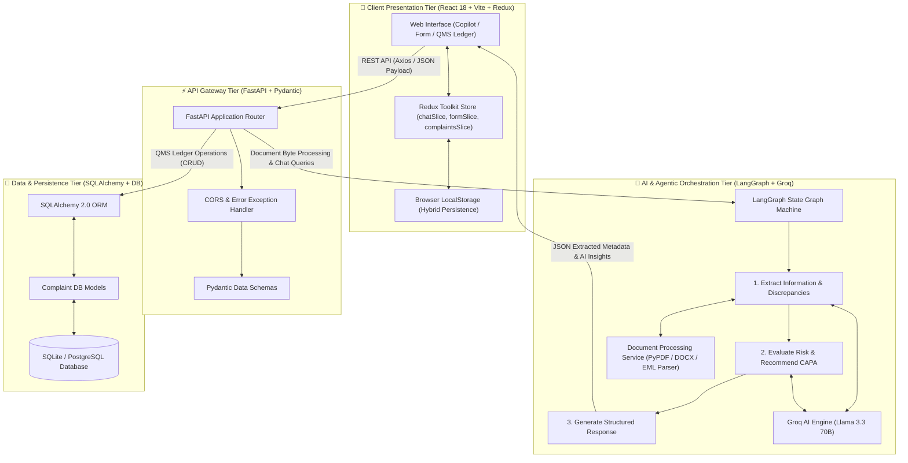
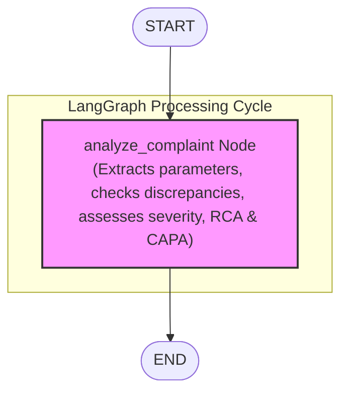
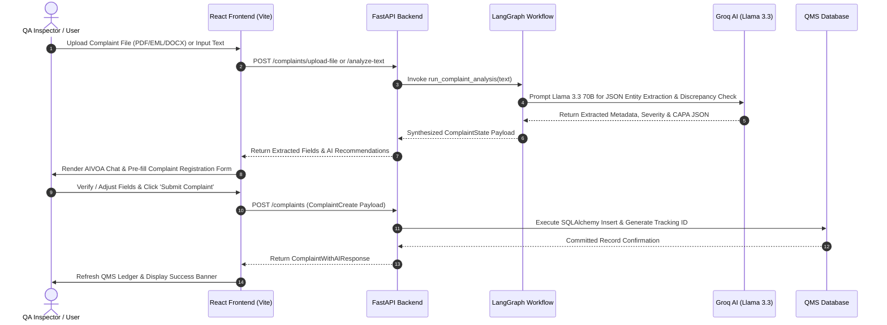

<div align="center">

# 🚀 Pharmaceutical Customer Complaint & AI QA Risk Module

[](https://www.python.org/)
[](https://fastapi.tiangolo.com/)
[](https://langchain-ai.github.io/langgraph/)
[](https://groq.com/)
[](https://react.dev/)
[](https://vitejs.dev/)
[](https://redux-toolkit.js.org/)
[](LICENSE)

*An enterprise-grade, AI-powered Quality Management System (QMS) module engineered for pharmaceutical Active Pharmaceutical Ingredients (API) & Finished Dosage Forms (FDF) compliance.*

</div>

---

## 📋 Table of Contents

- [Overview & Business Context](#-overview--business-context)
- [Key Features & Innovations](#-key-features--innovations)
- [System Architecture Design](#-system-architecture-design)
  - [Architecture Overview Flowchart](#1-architecture-overview-flowchart)
  - [LangGraph Agentic State Graph](#2-langgraph-agentic-state-graph)
  - [Sequence Diagram (End-to-End Data Flow)](#3-sequence-diagram-end-to-end-data-flow)
  - [Architectural Layer Breakdown](#4-architectural-layer-breakdown)
- [Tech Stack & Dependencies](#-tech-stack--dependencies)
- [Database Schema & Data Model](#-database-schema--data-model)
- [API Endpoints Reference](#-api-endpoints-reference)
- [Project Directory Structure](#-project-directory-structure)
- [Quickstart & Installation Guide](#-quickstart--installation-guide)
  - [Prerequisites](#prerequisites)
  - [1. Backend Setup](#1-backend-setup)
  - [2. Frontend Setup](#2-frontend-setup)
- [Git Update & Deployment Commands](#-git-update--deployment-commands)
- [License](#-license)

---

## 💡 Overview & Business Context

In global pharmaceutical manufacturing (cGMP, FDA 21 CFR Part 211 / Part 11, EU GMP Annex 11), customer complaint management and quality risk evaluation are vital for patient safety and regulatory compliance.

Traditional QMS systems suffer from manual data entry, slow root cause analysis (RCA), delayed Corrective and Preventive Action (CAPA) formulation, and missed discrepancies between customer narratives and shipping documents.

The **Pharmaceutical Customer Complaint & AI QA Risk Module** solves these operational bottlenecks by pairing a **FastAPI backend**, an **agentic LangGraph workflow engine**, **Groq Llama-3.3 70B inference**, and an interactive **React 18 / Redux Toolkit dashboard**.

---

## ✨ Key Features & Innovations

- **🤖 Agentic AI Copilot (AIVOA Copilot)**:
  - Multi-modal document ingestion: Upload PDF reports, EML emails, DOCX files, or raw text notices.
  - Automated field extraction: Instantly extracts Customer Name, Product Strength, Batch Code, Manufacturing/Expiry Dates, Affected Quantity, and Site Block.
  - Conversational form editing: Dynamic form updates via natural language chat (e.g. *"Update batch code to CHG 260712A"*).

- **🔍 Narrative vs Table Discrepancy Detection Engine**:
  - Automatically compares narrative complaint descriptions against tabular invoice/shipping metadata.
  - Detects subtle batch number typos (e.g. `MFH260712A` vs `MFH2607124`) without forcing assumptions, providing QA specialists with an analytical audit note.

- **📊 Audited QMS Ledger**:
  - Centralized ledger for tracking all logged pharmaceutical complaints.
  - Interactive status transitions (*New*, *Under Investigation*, *CAPA Assigned*, *Closed*).
  - Advanced search and multi-criteria filtering across products, customers, categories, dates, and severities.

- **💾 Resilience & Hybrid State Persistence**:
  - Client-side browser `localStorage` synchronization for seamless recovery of draft forms and active chat history across tab switches or network dropouts.
  - Backend database persistence backed by thread-safe SQLAlchemy 2.0 ORM sessions.

- **🧪 Built-in QA Demo Samples**:
  - Pre-packaged real-world pharmaceutical defect cases (Metformin API Foreign Matter, Amoxicillin Capsule Discoloration, Paracetamol IV Leakage) for zero-setup demonstration.

---

## 🏗️ System Architecture Design

The system is built on a decoupled, 4-tier microservices-inspired architecture designed for asynchronous processing, high availability, and AI agentic state management.

### 1. Architecture Overview Flowchart



---

### 2. LangGraph Agentic State Graph



---

### 3. Sequence Diagram (End-to-End Data Flow)



---

### 4. Architectural Layer Breakdown

#### A. Client Presentation Tier (`frontend/src`)
- **Framework**: React 18 powered by Vite for rapid HMR and optimized asset bundling.
- **State Management (`frontend/src/store`)**:
  - `chatSlice.js`: Manages real-time message state, document uploads, loading spinners, and AI responses.
  - `formSlice.js`: Manages form inputs, auto-filled fields, and validation state.
  - `complaintsSlice.js`: Handles fetching, filtering, and real-time status updates for the QMS Ledger.
- **UI Components (`frontend/src/components`)**:
  - `AIVOACopilot.jsx`: Split-screen workspace containing interactive AI chat, pre-set demo triggers, and real-time form auto-fill.
  - `ComplaintForm.jsx`: Dynamic registration form with validation and auto-fill highlight indicators.
  - `QMSLedger.jsx`: Audited ledger table with multi-field search, status filtering, and inline status updates.
  - `AIInsights.jsx`: Executive risk breakdown and visual analytics dashboard.

#### B. API Gateway & Application Tier (`backend/app/main.py`)
- **Framework**: FastAPI (Asynchronous Python ASGI web server).
- **Validation**: Pydantic v2 schemas (`ComplaintCreate`, `ComplaintResponse`, `ComplaintTextRequest`, `ChatUpdateRequest`, `DuplicateCheckRequest`).
- **Auto-Migration Engine**: Automatically executes DDL column additions for seamless database upgrades.

#### C. AI & Agentic Orchestration Tier (`backend/app/services`)
- **LangGraph Workflow (`langgraph_workflow.py`)**: State graph machine structuring multi-turn QA investigation.
- **Rule-Based Fallback Engine**: Intelligent regex and NLP fallback parser that guarantees zero-downtime operation even if external LLM APIs face network throttling.
- **Groq AI Integration (`ai_services.py`)**: High-speed inference using `llama-3.3-70b-versatile` / `qwen3.6-27b`.
- **Document Ingestion (`document_service.py`)**: Extractor supporting `.pdf` (PyPDF), `.docx` (python-docx), and `.eml` (email MIME decoder).

#### D. Database & Persistence Tier (`backend/app/database`)
- **ORM**: SQLAlchemy 2.0 with declarative base models (`backend/app/models/complaint.py`).
- **Database Engine**: Configured for SQLite (local dev) and PostgreSQL (production).

---

## 🛠️ Tech Stack & Dependencies

| Layer | Technology | Purpose / Function |
| :--- | :--- | :--- |
| **Frontend Framework** | React 18 | Declarative UI rendering |
| **Build Tool** | Vite 5 | Fast development server & production builder |
| **State Management** | Redux Toolkit | Centralized state management & LocalStorage persistence |
| **Styling** | Vanilla CSS + TailwindCSS | Modern, responsive glassmorphism UI |
| **Backend API** | FastAPI (Python 3.10+) | High-performance asynchronous REST API |
| **Agentic Framework** | LangGraph | State graph orchestration for complex AI workflows |
| **LLM Provider** | Groq SDK (`llama-3.3-70b-versatile`) | Ultra-fast LLM inference |
| **Doc Parsers** | PyPDF, python-docx, email | Parsing PDF, Word documents, and email MIME files |
| **Database & ORM** | SQLAlchemy 2.0 / SQLite / PostgreSQL | Audited QMS Ledger storage |

---

## 💾 Database Schema & Data Model

The primary relational entity `complaints` represents an audited QMS record:

```sql
CREATE TABLE complaints (
    id INTEGER PRIMARY KEY AUTOINCREMENT,
    complaint_source VARCHAR(100),
    customer_name VARCHAR(255),
    product_name VARCHAR(255),
    product_strength VARCHAR(100),
    batch_number VARCHAR(100),
    affected_quantity VARCHAR(100),
    manufacturing_date VARCHAR(100),
    expiry_date VARCHAR(100),
    originating_site_block VARCHAR(255),
    impacted_npm VARCHAR(255),
    complaint_type VARCHAR(100),
    complaint_date VARCHAR(100),
    complaint_description TEXT,
    category VARCHAR(100),
    sentiment VARCHAR(50),
    priority VARCHAR(50),
    severity VARCHAR(50),
    suggested_next_action TEXT,
    initial_risk_assessment TEXT,
    root_cause_recommendation TEXT,
    capa_recommendation TEXT,
    completeness_score INTEGER,
    executive_summary TEXT,
    status VARCHAR(50) DEFAULT 'New',
    created_at DATETIME DEFAULT CURRENT_TIMESTAMP,
    updated_at DATETIME DEFAULT CURRENT_TIMESTAMP
);
```

---

## 🔌 API Endpoints Reference

| Endpoint | Method | Description | Payload / Query |
| :--- | :--- | :--- | :--- |
| `GET /` | `GET` | Health check endpoint | N/A |
| `POST /complaints/upload-file` | `POST` | Upload PDF/EML/DOCX complaint file & extract metadata | `multipart/form-data` file |
| `POST /complaints/analyze-text` | `POST` | Analyze raw text or pasted complaint via AI | `{"text": "..."}` |
| `POST /complaints/chat-update` | `POST` | Follow-up conversational chat & dynamic form editing | `{"user_message": "...", "current_form": {...}}` |
| `POST /complaints/duplicate-check` | `POST` | Search database for potential duplicate batch complaints | `{"batch_number": "..."}` |
| `GET /complaints/samples` | `GET` | Fetch pre-configured sample complaints for testing | N/A |
| `POST /complaints` | `POST` | Commit verified complaint into QMS Ledger | `ComplaintCreate` JSON |
| `GET /complaints` | `GET` | Retrieve list of all complaints in QMS Ledger | N/A |
| `GET /complaints/{id}` | `GET` | Get single complaint details by ID | Path parameter `id` |
| `PUT /complaints/{id}/status` | `PUT` | Update complaint status (*New*, *Under Investigation*, *CAPA Assigned*, *Closed*) | Query parameter `status` |

---

## 📁 Project Directory Structure

```
customer-complaint-system/
├── backend/
│   ├── app/
│   │   ├── core/
│   │   │   └── config.py
│   │   ├── database/
│   │   │   ├── base.py
│   │   │   ├── database.py
│   │   │   └── session.py
│   │   ├── models/
│   │   │   └── complaint.py
│   │   ├── services/
│   │   │   ├── ai_services.py
│   │   │   ├── document_service.py
│   │   │   └── langgraph_workflow.py
│   │   ├── main.py
│   │   └── schemas.py
│   ├── requirements.txt
│   └── .env
├── frontend/
│   ├── src/
│   │   ├── assets/
│   │   ├── components/
│   │   │   ├── AIInsights.jsx
│   │   │   ├── AIVOACopilot.jsx
│   │   │   ├── ComplaintForm.jsx
│   │   │   ├── Navbar.jsx
│   │   │   ├── NotificationBanner.jsx
│   │   │   └── QMSLedger.jsx
│   │   ├── store/
│   │   │   ├── chatSlice.js
│   │   │   ├── complaintsSlice.js
│   │   │   ├── formSlice.js
│   │   │   └── index.js
│   │   ├── App.jsx
│   │   ├── App.css
│   │   ├── index.css
│   │   └── main.jsx
│   ├── package.json
│   └── vite.config.js
├── run_backend.bat
├── run_frontend.bat
└── README.md
```

---

## 🚀 Quickstart & Installation Guide

### Prerequisites
- **Python 3.10+**
- **Node.js 18+** & **npm**
- **Git**

### 1. Backend Setup

```bash
# 1. Navigate to the backend directory
cd backend

# 2. Create a virtual environment
python -m venv .venv

# 3. Activate the virtual environment
# On Windows:
.venv\Scripts\activate
# On macOS/Linux:
source .venv/bin/activate

# 4. Install dependencies
pip install -r requirements.txt

# 5. Configure environment variables (Create .env file)
# GROQ_API_KEY=your_groq_api_key_here

# 6. Run FastAPI application server
python -m uvicorn app.main:app --host 127.0.0.1 --port 8000 --reload
```

- **Backend API Server**: `http://127.0.0.1:8000`
- **Swagger Interactive API Docs**: `http://127.0.0.1:8000/docs`

---

### 2. Frontend Setup

```bash
# 1. Navigate to the frontend directory
cd frontend

# 2. Install dependencies
npm install

# 3. Start Vite development server
npm run dev
```

- **Frontend Application**: `http://127.0.0.1:5173`

---

## 💻 Git Update & Deployment Commands

To stage, commit, and push this updated `README.md` and repository changes to GitHub, execute the following commands in your terminal:

```bash
# 1. Ensure you are inside the Git repository directory
cd customer-complaint-system-13a3c935b9cffba8e55c3e5d0fe8e11ec6d846bb

# 2. Check Git status
git status

# 3. Stage the README.md and modified files
git add README.md backend/app/database/database.py

# 4. Create a commit
git commit -m "docs: update README with comprehensive system architecture design, mermaid diagrams, and API specifications"

# 5. Push changes to GitHub main branch
git push origin main
```

---

## 📄 License

This project is licensed under the **MIT License** - see the [LICENSE](LICENSE) file for details.
